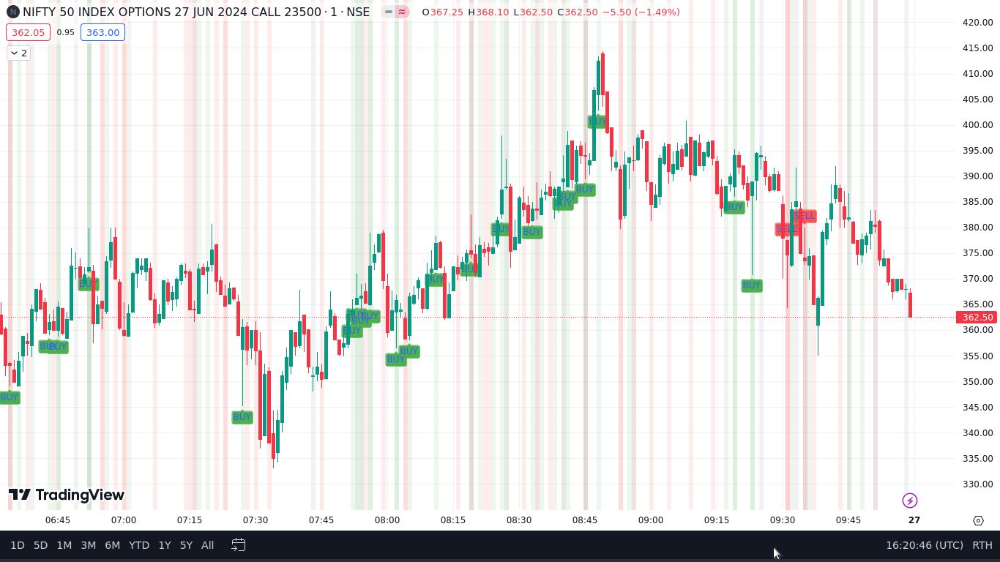

# Advanced Candlestick Pattern Analyzer for TradingView

## Overview
The **Advanced Candlestick Pattern Analyzer** is a powerful TradingView indicator that identifies various candlestick and chart patterns to help traders make informed decisions. It detects bullish and bearish patterns, providing visual cues on the chart to indicate potential buy and sell opportunities.

## Features
- Detects multiple candlestick patterns:
  - Bullish Engulfing
  - Bearish Engulfing
  - Hammer
  - Inverted Hammer
  - Shooting Star
  - Hanging Man
  - Doji
  - Piercing
  - Morning Star
  - Three White Soldiers
  - Bullish Harami
  - Bearish Harami
  - Double Bottom
  - Double Top
  - Triple Bottom
  - Triple Top
- Visual cues for buy and sell signals
- Easy to integrate with TradingView

## How It Works
The script analyzes historical price data to detect specific candlestick patterns and highlights them on the chart. When a pattern is detected, it provides a color-coded background and/or a label indicating a potential buy or sell signal.

## Installation
1. **Open TradingView**: Go to [TradingView](https://www.tradingview.com/).
2. **Open Pine Editor**: At the bottom of the TradingView page, click on the "Pine Editor" tab.
3. **Copy and Paste the Script**: Copy the Pine Script code from this repository and paste it into the Pine Editor.
4. **Save the Script**: Click on the "Save" button, give the script a name, and save it.
5. **Add to Chart**: Click on the "Add to Chart" button to apply the indicator to your chart.

## Usage
1. Once the script is added to your chart, it will automatically start analyzing the candlestick patterns.
2. Buy signals will be indicated by green labels and backgrounds, while sell signals will be indicated by red labels and backgrounds.
3. Adjust the chart's time frame and zoom level to see how the indicator performs with different data sets.

## Example
Here's an example of how the indicator looks on a chart:

## Screenshots
### Bullish Patterns

### Bearish Patterns

## Video Tutorial

<video width="600" controls>
  <source src="https://github.com/Vatsal-Shashwat/Advanced-Candlestick-Pattern-Analyzer/blob/main/tutorial.mp4" type="video/mp4">
  Your browser does not support the video tag.
</video>

## Contributions
Contributions are welcome! If you have any suggestions, enhancements, or bug fixes, please open an issue or submit a pull request.

## License
This project is licensed under the MIT License.

## Disclaimer
Trading involves risk. The Advanced Candlestick Pattern Analyzer is a tool to assist in technical analysis and does not guarantee profitable trading outcomes. Use it at your own discretion.

---

Thank you for using the Advanced Candlestick Pattern Analyzer! Happy Trading!
